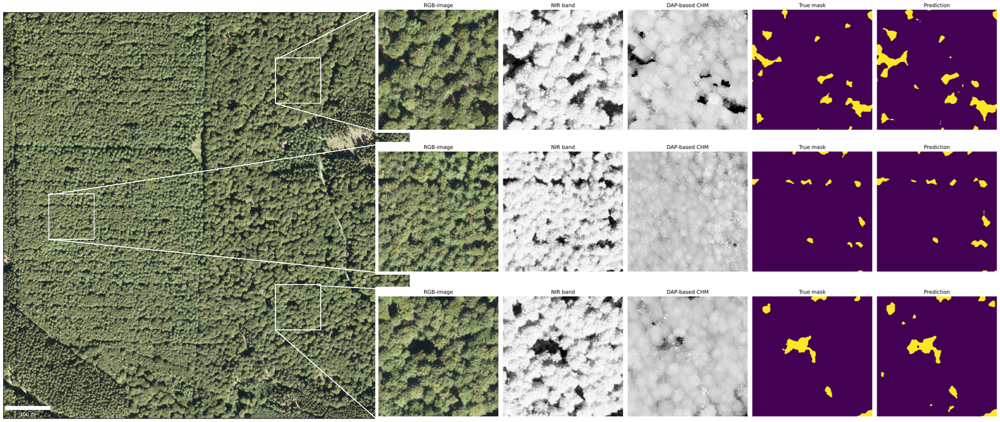

# Deep learning-based canopy gap detection using a cross-technological approach with airborne laser scanning and aerial imagery data


*Canopy gap detection in three enlarged subareas (white rectangles).*

This repository contains code for forest canopy gap detection using a deep learning model trained on gaps automatically generated from Airborne Laser Scanning (ALS)-derived Canopy Height Models (CHMs), combined with spectral (True Digital Orthophotos) and height information from Digital Aerial Photogrammetry (DAP)-based CHMs. For further details, see the following paper:

Franz, F., Seidel, D., Beckschäfer, P., in press. Deep learning-based canopy gap detection using a cross-technological approach with airborne laser scanning and aerial imagery data. *Ecol. Informatics.*

The datasets to reproduce the analysis as well as the trained model are available on [Zenodo](https://zenodo.org/records/17829462).

## Folder structure

The project follows a structured organization for data, scripts, and outputs. Execute `src/setup.R` or `src/setup.py` to automatically create the required folder structure.

```
canopy-gap-detection/
├── data/
│   ├── raw_data/
│   │   ├── DOPs/                    # DOPs (aerial imagery)
│   │   ├── laz_ALS/                 # ALS point clouds (already ground classified)
│   │   ├── laz_DAP/                 # DAP based point clouds
│   │   ├── dtm_tiles/               # Digital terrain model point cloud tiles
│   │   └── test_tiles/              # Test data tiles extent
│   ├── processed_data/
│   │   ├── DOPs/                    # Processed DOPs
│   │   ├── nDSMs_ALS/               # Normalized digital surface models from ALS (raster files)
│   │   ├── nDSMs_DAP/               # Normalized digital surface models from DAP (raster files)
│   │   ├── laz_ALS/                 # Processed ALS point clouds
│   │   ├── laz_DAP/                 # Processed DAP point clouds
│   │   ├── datasets/                # Training and testing datasets
│   │   ├── models/                  # Trained deep learning model
│   │   ├── gap_polygons_ALS/        # Gap polygons derived from ALS data
│   │   └── gap_polygons_DAP/        # Gap polygons derived from DAP data
│   └── metadata/                    # Metadata and documentation files
├── src/                             # Functions and setup scripts
│   ├── setup.R                      # R setup script for folder creation
│   ├── setup.py                     # Python setup script for folder creation
│   ├── detect_gaps_multi_stage.R    # Multi-stage gap detection algorithm
│   ├── create_mosaic.R              # Function for mosaic creation from multiple tiles
│   ├── rename_files.R               # Utility script for file renaming
│   ├── preprocess_lidar_files.R     # Function for LiDAR data preprocessing
│   └── cidg.py                      # Image data generation for model training
├── scripts/                         # Analysis and processing scripts
│   ├── gap_generation.R             # Gap generation from ALS data
│   ├── gap_comp_dap_vs_pred.R       # Compare DAP vs prediction results
│   ├── model_train.ipynb            # Model training notebook
│   ├── prediction.ipynb             # Prediction and inference notebook
│   ├── test_data_preparation.ipynb  # Test dataset preparation
│   ├── train_data_preparation.ipynb # Training dataset preparation
│   ├── merge_CHM_tiles.R            # Merge ALS raster tiles
│   ├── dap_ndsm_mosaic_creation.R   # Create nDSM mosaics from DAP data
│   ├── dap_cloud_2_ndsm.R           # DAP point cloud processing
│   └── lidar_preprocessing.R        # ALS point cloud processing
└── output/                          # Results and output files
```

## Requirements

- R 4.4.0
- Python 3.10.12

## Citation

```
@article{franz2026deep,
  title={Deep learning-based canopy gap detection using a cross-technological approach with airborne laser scanning and aerial imagery data},
  author={Franz, Florian and Seidel, Dominik and Becksch{\"a}fer, Philip},
  journal={Ecological Informatics},
  pages={},
  year={in press},
  publisher={Elsevier}
}
```